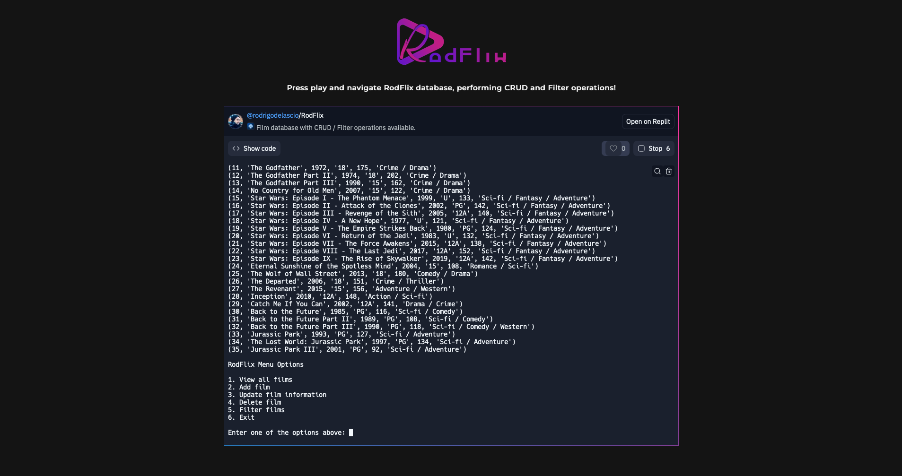

## Table of contents

- [Overview](#overview)
- [The purpose](#the-purpose)
- [Screenshot](#screenshot)
- [Link](#links)
- [Built with](#built-with)
- [Author](#author)

## Overview

A database to navigate and perform CRUD and filter operations, applying changes in real time.

## The purpose

Users should be able to:

- Perform CRUD and filter operations
- See changes applied in real time

## Screenshot

## Link

- Live Site URL: [Follow this link](https://replit.com/@rodrigodelascio/RodFlix?embed=true)

## Built with

- Python

## Author

- Website - [Rodrigo de Lascio](https://rodrigodelascio.co.uk/)
- GitHub - [@rodrigodelascio](https://github.com/rodrigodelascio)
- LinkedIn - [@rodrigodelascio](https://www.linkedin.com/in/rodrigo-de-lascio/)
